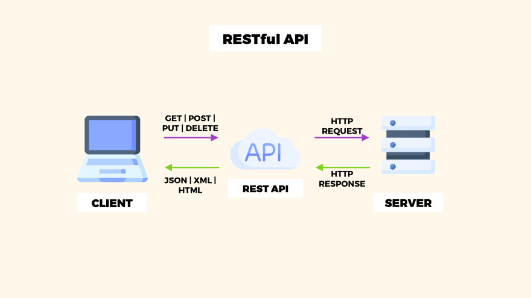

# Spring REST 

ㅤIn this project you can see working with Spring REST. We use Hibernate and Java Persistence API, JSON, MySQL, Spring Security.  We can see the 4 main CRUD data management functions ( create - read - update - delete ).

